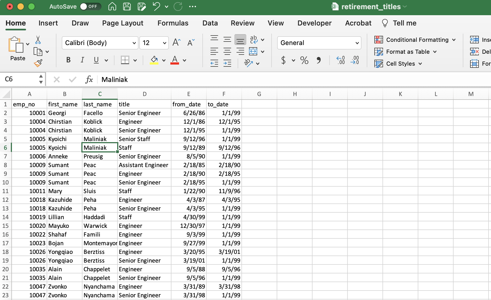
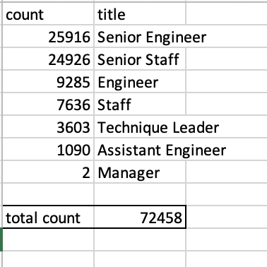
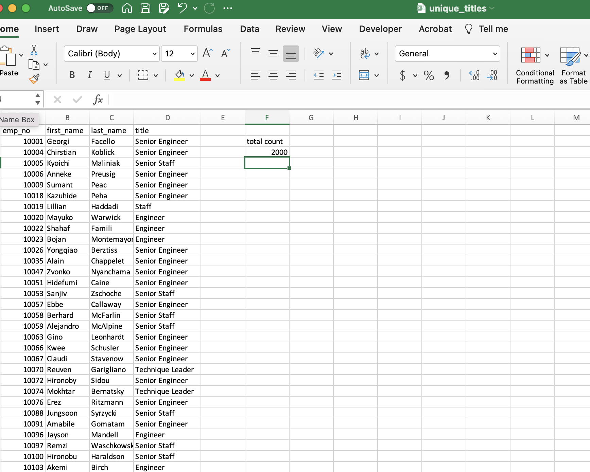
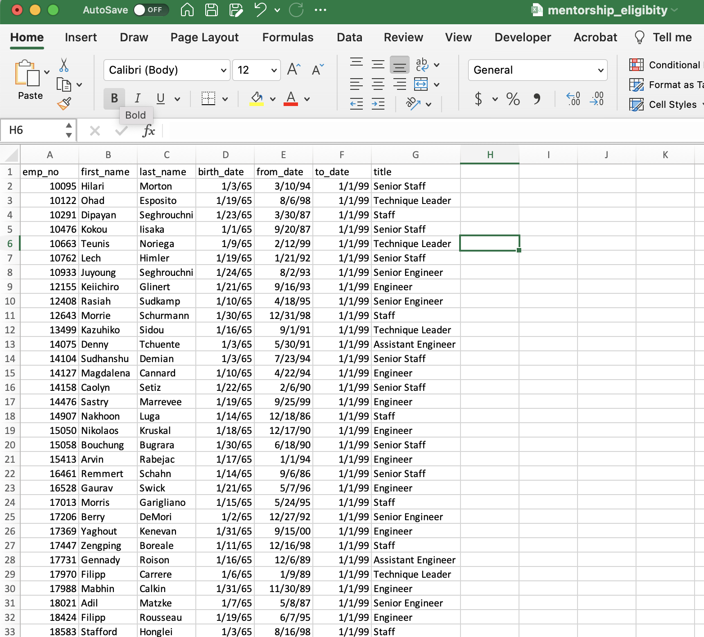

# Pewlett Hackard Analysis

## Overview

##### Initial Approach

Pewlett Hackard is a large company, with around 700 employees, and it has been around for a long time. Their older, baby-boomer employees are nearing the age of retirement, and as the generational alias suggests, there will be a large number of people who may be geared for retirement around the same time. For a sea baby-boomers, this is like a "silver tsunami." The prospect calls for preemptive action.

Bobby, an HR Analyst in Pewlett Hackard, has approached us to help him perform directed research of PH's employee database. We will be looking to answer the following questions:

- Who will be retiring in the near future?
- How many positions will be vacant?

##### Programmatic Execution

Pewlett Hackard's HR department has their database stored in .csv format. In order to perform a deeper analysis into these large numbers, we used SQL databases, where we were able to use our modeling, engineering and analysis skills to produce material that  reveals the status of the HP staff contingency. Our output will be valuable tools for PH HR Department when elaborating new retirement packages and trainee programs for the future.

##### Final Content

We are delivering a number of new tables in .csv format, as well as an .sql file with the queries that we used to join and select relevant data from the original tables, to create the new ones. With our material PH will now have:

- The number of employees that will be retiring in the near future, and the titles that those employees currently hold.

- HP is elaborating a Mentorship Program for those amongst the larger pole who will be retiring in the more immediate future. We created a database to reflect the data on those employees that are eligible to join the program.

  

## **Results** 

These are major points that we can infer from the analysis :

1. The retirement titles vary, but there is a higher amount of senior titles. The table we created first gave us a glimpse into those employees and their data:

   

   

   - There are a total of 72,458 retiring titles. They are delineated in this table:

     

     

2. There are 2,000 unique titles, as seen in the snippet of the table shown below. Those are the titles most recently occupied by retiring employees:

   

   

3. There are 1,549 employees born between January 1, 1965 and December 31, 1965 who are counted amongst the first wave of employees to retire who will be eligible to participate in the Mentorship Program. Here is a snippet of the table that contains that data:

   

   

4. Senior positions will be in higher demand proportionally. The Mentorship program will need to be elaborated in a format that will cater to those needs.

## Summary

##### Insight Into The Future

- How many roles will need to be filled as the "silver tsunami" begins to make an impact? 

  Looking at our Mentorship Eligibility table, we can see that there will be 1,549 roles that will need to be filled as the "silver tsunami" begins to take impact.

- Are there enough qualified, retirement-ready employees in the departments to mentor the next generation of Pewlett Hackard employees?

  There are a total of 72,458 titles that will be vacant when the "silver tsunami" is complete. If all 1,549 employees that will compose the first wave of retirees do follow through, and complete the Mentorship  Program, there may still not be enough qualified employees to mentor the next generation.

  - In order to address that, we would need to concoct a new table that, using our potent tools, would filter through the databases that we have stored in SQL format, and return the data output on the upcoming waves. 
  - In other words, using the same queries, we can repurpose the code to create a new Mentor Eligibility table to reflect the next age group that will be eligible to participate in the next phase of the Mentorship Program.
  - We will need to create a new database that will keep track of the count of retirees from the multiples waves that adhere to the first, second and subsequent stages of the Mentorship Program.
  - Using that information, we can gauge the ratio of qualified mentors versus incoming employees at every stage, and create outreach programs for those retirees who may still be willing to consider joining the Mentorship program.
